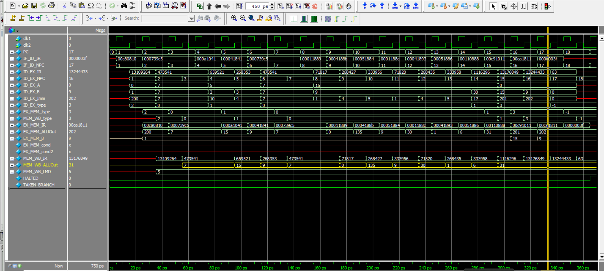
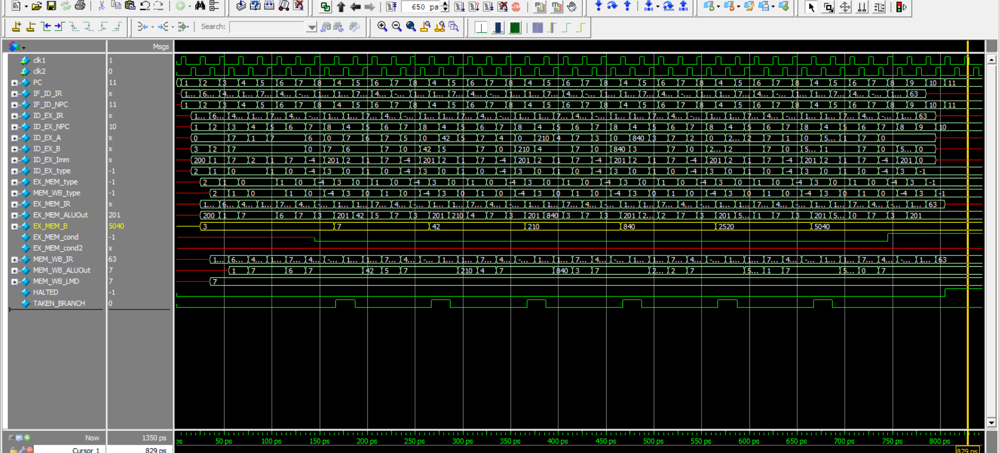

# 🧠 32-bit RISC Processor (Verilog)

## 📌 Overview

This project presents the **design and implementation of a 32-bit RISC processor** using **Verilog HDL** in RTL design style. The processor follows a **pipelined architecture** to improve instruction throughput and overall performance.

---

## 🧠 Architecture

* 5-stage pipeline: **IF, ID, EX, MEM, WB**
* 32 general-purpose registers (**R0–R31**)
* **R0 is hardwired to zero**
* 32-bit Program Counter (PC)
* Word-addressable memory
* Separate ALU and Control Unit
* Supports **R-type and I-type instruction formats**

---

## 🔧 Features

* Efficient RTL design using Verilog
* Pipeline-based execution for improved performance
* No flag registers (zero, carry, sign)
* Supports arithmetic, logical, memory, and branching operations
* Modular design (ALU, Register File, Control Unit, Memory)

---

## ⚙️ Tools Used

* **Intel Quartus Prime** → RTL synthesis
* **ModelSim** → Simulation and waveform analysis

---

## 📚 Instruction Set

The processor supports **27 instructions**, including:

* **Arithmetic**: ADD, ADDI, SUB, SUBI, MUL
* **Logical**: AND, OR, XOR, ANDI, ORI, XORI
* **Shift Operations**: SLL, SRL, SLLI, SRLI
* **Memory Access**: LW, SW
* **Branching**: BEQ, BNEQ, BEQZ, BNEQZ
* **Control**: JMP, HLT

---

## 🧪 Testbenches

Two testbenches were developed for verification:

* **ALU Operations Testbench** → validates arithmetic & logical instructions
* **Factorial Computation Testbench** → verifies looping and branching behavior

---

## 📊 Results

* Successfully simulated using ModelSim
* Correct execution of instructions across pipeline stages
* Verified using waveform analysis
* Accurate computation of factorial using loop instructions

---

## 📂 Project Structure

```
32bit-RISC-Processor/
│
├── src/          # Verilog design files
├── testbench/    # Simulation testbenches
├── docs/         # Reports, instruction set, RTL diagrams
├── waveforms/    # Simulation waveform outputs
└── README.md
```

---

## 🚀 How to Run

1. Open **ModelSim**
2. Compile all Verilog source files
3. Run testbench:

   * `alu_tb.v` (ALU verification)
   * `factorial_tb.v` (factorial program)
4. View waveform using generated `.vcd` file

---

## 📈 Waveforms

### 🔹 ALU Operations



### 🔹 Factorial Computation



---

## 💡 Key Learning Outcomes

* RTL design of a processor using Verilog
* Understanding of pipelined architecture
* Instruction execution and control flow
* Simulation and debugging using ModelSim

---

## 👨‍💻 Author

**Vedant Saxena**
